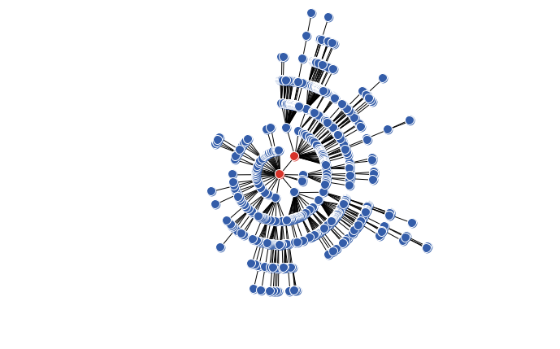
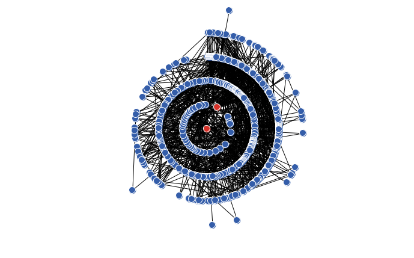
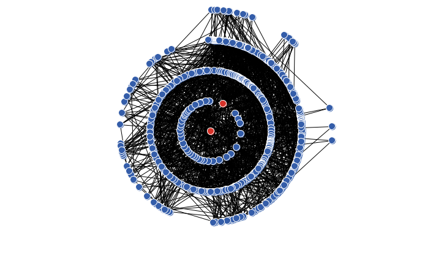

```{r setup, include=FALSE}
knitr::opts_chunk$set(echo = TRUE)
```

# Análisis sobre las redes de libre escala.

Para generar la red de libre escala usaremos el modelo de Barabási–Albert (BA), despues añadiremos aristas aleatoriamente de acuerdo con el modelo de Erdős-Rényi (ER). El modelo (ER) añade aristas de acuerdo a una probabilidad `p`, para este ejercicio, `p` tomará los valores; 0, 0.0025, 0,005 y 0.0075.

El código que generará el grafo es el siguiente.

```{bash, eval=FALSE}
to prueba
  clear
  random-seed 2017
  BA-PA 500 2 1
  ER-RN 0 p
  layout "radial"
end
```

Con `random-seed` hemos fijado la semilla para que (ER) siempre añada aristas basandose en el misma red (BA). 

Estudiaremos las medidas de centralidad basandonos en esta red. No estudiaremos el coeficiente de Clustering pues nos encontramos en una red libre de escala, y por tanto conexa.

## Representación de los 4 casos.

* Para p = 0



* Para p = 0.0025


* Para p = 0.005



* Para p = 0.0075



## Distribución de los grados.

```{r}
datos1 <- read.csv("./data/dd1.csv")
datos2 <- read.csv("./data/dd2.csv")
datos3 <- read.csv("./data/dd3.csv")
datos4 <- read.csv("./data/dd4.csv")
par(mfrow=c(2,2))
plot(datos1$x,datos1$y,type="h", lwd=3, lend="square", 
     xlim = c(0,50), ylim=c(0,350), main="p=0", 
     xlab="Grado", ylab="Nodos")
plot(datos2$x,datos2$y,type="h", lwd=3, lend="square",
     xlim = c(0,50), ylim=c(0,350), main="p=0.0025", 
     xlab="Grado",ylab="Nodos")
plot(datos3$x,datos3$y,type="h", lwd=3, lend="square",
     xlim = c(0,50), ylim=c(0,350), main="p=0.005", 
     xlab="Grado",ylab="Nodos")
plot(datos4$x,datos4$y,type="h", lwd=3, lend="square",
     xlim = c(0,50), ylim=c(0,350), main="p=0.0075", 
     xlab="Grado",ylab="Nodos")
```


## Centralidad Eigenvector. 

```{r}
datos1 <- read.csv("./data/ed1.csv")
datos2 <- read.csv("./data/ed2.csv")
datos3 <- read.csv("./data/ed3.csv")
datos4 <- read.csv("./data/ed4.csv")
par(mfrow=c(2,2))
plot(datos1$x,datos1$y,type="h", lwd=3, lend="square", 
     xlim = c(0,1), ylim=c(0,300), main="p=0", 
     xlab="Eigenvector", ylab="Nodos")
plot(datos2$x,datos2$y,type="h", lwd=3, lend="square",
     xlim = c(0,1), ylim=c(0,300), main="p=0.0025", 
     xlab="Eigenvector",ylab="Nodos")
plot(datos3$x,datos3$y,type="h", lwd=3, lend="square",
     xlim = c(0,1), ylim=c(0,300), main="p=0.005", 
     xlab="Eigenvector",ylab="Nodos")
plot(datos4$x,datos4$y,type="h", lwd=3, lend="square",
     xlim = c(0,1), ylim=c(0,300), main="p=0.0075", 
     xlab="Eigenvector",ylab="Nodos")
```


## Centralidad Betweenness.

```{r}
datos1 <- read.csv("./data/bd1.csv")
datos2 <- read.csv("./data/bd2.csv")
datos3 <- read.csv("./data/bd3.csv")
datos4 <- read.csv("./data/bd4.csv")
par(mfrow=c(2,2))
plot(datos1$x,datos1$y,type="h", lwd=3, lend="square", 
     xlim = c(0,17500), ylim=c(0,500), main="p=0", 
     xlab="Betweenness.", ylab="Nodos")
plot(datos2$x,datos2$y,type="h", lwd=3, lend="square",
     xlim = c(0,17500), ylim=c(0,500), main="p=0.0025", 
     xlab="Betweenness.",ylab="Nodos")
plot(datos3$x,datos3$y,type="h", lwd=3, lend="square",
     xlim = c(0,17500), ylim=c(0,500), main="p=0.005", 
     xlab="Betweenness.",ylab="Nodos")
plot(datos4$x,datos4$y,type="h", lwd=3, lend="square",
     xlim = c(0,17500), ylim=c(0,500), main="p=0.0075", 
     xlab="Betweenness.",ylab="Nodos")
```

## Centralidad Closeness.

```{r}
datos1 <- read.csv("./data/cd1.csv")
datos2 <- read.csv("./data/cd2.csv")
datos3 <- read.csv("./data/cd3.csv")
datos4 <- read.csv("./data/cd4.csv")
par(mfrow=c(2,2))
plot(datos1$x,datos1$y,type="h", lwd=3, lend="square", 
     xlim = c(0,1), ylim=c(0,100), main="p=0", 
     xlab="Closeness", ylab="Nodos")
plot(datos2$x,datos2$y,type="h", lwd=3, lend="square",
     xlim = c(0,1), ylim=c(0,100), main="p=0.0025", 
     xlab="Closeness",ylab="Nodos")
plot(datos3$x,datos3$y,type="h", lwd=3, lend="square",
     xlim = c(0,1), ylim=c(0,100), main="p=0.005", 
     xlab="Closeness",ylab="Nodos")
plot(datos4$x,datos4$y,type="h", lwd=3, lend="square",
     xlim = c(0,1), ylim=c(0,100), main="p=0.0075", 
     xlab="Closeness",ylab="Nodos")
```

## Distribucion del PageRank.

```{r}
datos1 <- read.csv("./data/pd1.csv")
datos2 <- read.csv("./data/pd2.csv")
datos3 <- read.csv("./data/pd3.csv")
datos4 <- read.csv("./data/pd4.csv")
par(mfrow=c(2,2))
plot(datos1$x,datos1$y,type="h", lwd=3, lend="square", 
     xlim = c(0,0.04), ylim=c(0,350), main="p=0", 
     xlab="Page Ranking", ylab="Nodos")
plot(datos2$x,datos2$y,type="h", lwd=3, lend="square",
     xlim = c(0,0.04), ylim=c(0,350), main="p=0.0025", 
     xlab="Page Ranking",ylab="Nodos")
plot(datos3$x,datos3$y,type="h", lwd=3, lend="square",
     xlim = c(0,0.04), ylim=c(0,350), main="p=0.005", 
     xlab="Page Ranking",ylab="Nodos")
plot(datos4$x,datos4$y,type="h", lwd=3, lend="square",
     xlim = c(0,0.04), ylim=c(0,350), main="p=0.0075", 
     xlab="Page Ranking",ylab="Nodos")
```

# Análisis del diámetro y la longitud.

Representaremos el diámetro y la longitud para varios modelos. Estos modelos serán, Kleem-Eguilez, Watts-Strogatz, Barabasi-Albert (el usual) y el modelo Barabasi-Albert del anterior apartado. Tomaremos probabilidad $p=0.005$.

La generación de estos modelos respectivamente será,

```{bash, eval=FALSE}
to errn
  clear
  random-seed 2017
  KE 500 10 0.005
  layout "radial"
end
```

```{bash, eval=FALSE}
to wast
  clear
  random-seed 2017
  WS 500 20 p
  layout "radial"
end
```

```{bash, eval=FALSE}
to baal
  clear
  random-seed 2017
  BA-PA 500 2 1
  layout "radial"
end
```

Y obtenemos los siguientes resultados,


| Modelo        | Diámetro     | Longitud |
|:--------------|-------------:|---------:|
| KE            |            3 |    2.354 |
| WS            |            9 |    4.662 |
| BA            |           12 |    5.915 |
| BA modificado |            6 |    3.875 |

Destacar en especial, que el modelo WS depende del grado inicial. A mayor grado inicial, menor diámetro y longitud. También tiene sentido las diferencias entre el BA y el BA modificado, ya que a uno de ellos estamos añadiendole mas aristas.

# Experimentos de infección

Por los resultados obtenidos en el anteriror apartado, parace interesante ver como se comportaria una infencción en una red BA con los parámetros usados anteriormente.

```{bash, eval=FALSE}
to baal
  clear
  random-seed 2017
  BA-PA 500 2 1
  layout "radial"
end
```

Por ello usaremos la función `Spread m ps pr pin iter` de Netlogo. Presenta los siguientes parámetros

* `m`: El número de nodos infectado.

* `ps`: Probabilidad de infección a un nodo contiguo.

* `pr`: Probabilidad de recuperacción.

* `pin`: Probabilidad de inmunidad despues de una recuperación.

* `iter`: Número de iteracciones.

Despues de interaccionar con los parámetros observamos lo siguiente.

* Si la probabilidad de recuperación es baja, entonces por muy alto que sea la probabilidad de inmunidad, es muy probable que la red acabe contagiada por completo. Si aumentamos el número de iteracciones se empiezan a observar algunas inmunidades.

* Si la probabilidad de inmunidad tras la recuperación es alta, tras un número de iteracciones no demasiado grande, la red se hace inmune a la enfermedad.

* Sea cual sea la cantidad de nodos que tomemos al inicio, si los parametros de contagio son razonables, la enfermedad llega a los "centros" de la red en pocas iteracciones. De la misma manera, los elementos mas alejados del centro tardan más en adquirir la enfermedad.

* Si escogemos parámetros distintos a cero para cada probabilidad, en suficientes interacciones llegamos a la inmunidad en toda la red.


