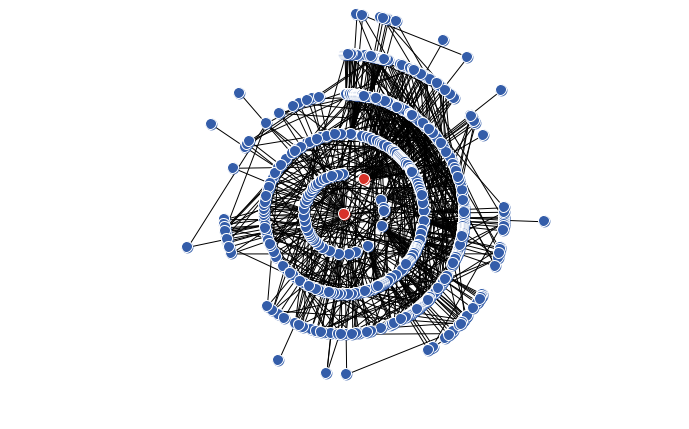

```{r setup, include=FALSE}
knitr::opts_chunk$set(echo = TRUE)
```

# Análisis sobre las redes de libre escala.

Para generar la red de libre escala usaremos el modelo de Barabási–Albert (BA), despues añadiremos aristas aleatoriamente de acuerdo con el modelo de Erdős-Rényi (ER). El modelo (ER) añade aristas de acuerdo a una probabilidad `p`, para este ejercicio, `p` tomará los valores; 0, 0.0025, 0,005 y 0.0075.

El código que generará el grafo es el siguiente.

```{bash, eval=FALSE}
to prueba
  clear
  random-seed 2017
  BA-PA 500 2 1
  ER-RN 0 p
  layout "radial"
end
```

Con `random-seed` hemos fijado la semilla para que (ER) siempre añada aristas basandose en el misma red (BA). 

Estudiaremos las medidas de centralidad basandonos en esta red. No estudiaremos el coeficiente de Clustering pues nos encontramos en una red libre de escala, y por tanto conexa.

## Representación de los 4 casos.

* Para p = 0


* Para p = 0.0025




* Para p = 0.005


* Para p = 0.0075


## Distribución de los grados.

```{r}
datos1 <- read.csv("./data/dd1.csv")
datos2 <- read.csv("./data/dd2.csv")
datos3 <- read.csv("./data/dd3.csv")
datos4 <- read.csv("./data/dd4.csv")
par(mfrow=c(2,2))
plot(datos1$x,datos1$y,type="h", lwd=3, lend="square", 
     xlim = c(0,50), ylim=c(0,350), main="p=0", 
     xlab="Grado", ylab="Nodos")
plot(datos2$x,datos2$y,type="h", lwd=3, lend="square",
     xlim = c(0,50), ylim=c(0,350), main="p=0.0025", 
     xlab="Grado",ylab="Nodos")
plot(datos3$x,datos3$y,type="h", lwd=3, lend="square",
     xlim = c(0,50), ylim=c(0,350), main="p=0.005", 
     xlab="Grado",ylab="Nodos")
plot(datos4$x,datos4$y,type="h", lwd=3, lend="square",
     xlim = c(0,50), ylim=c(0,350), main="p=0.0075", 
     xlab="Grado",ylab="Nodos")
```


## Centralidad Eigenvector. 

```{r}
datos1 <- read.csv("./data/ed1.csv")
datos2 <- read.csv("./data/ed2.csv")
datos3 <- read.csv("./data/ed3.csv")
datos4 <- read.csv("./data/ed4.csv")
par(mfrow=c(2,2))
plot(datos1$x,datos1$y,type="h", lwd=3, lend="square", 
     xlim = c(0,1), ylim=c(0,300), main="p=0", 
     xlab="Eigenvector", ylab="Nodos")
plot(datos2$x,datos2$y,type="h", lwd=3, lend="square",
     xlim = c(0,1), ylim=c(0,300), main="p=0.0025", 
     xlab="Eigenvector",ylab="Nodos")
plot(datos3$x,datos3$y,type="h", lwd=3, lend="square",
     xlim = c(0,1), ylim=c(0,300), main="p=0.005", 
     xlab="Eigenvector",ylab="Nodos")
plot(datos4$x,datos4$y,type="h", lwd=3, lend="square",
     xlim = c(0,1), ylim=c(0,300), main="p=0.0075", 
     xlab="Eigenvector",ylab="Nodos")
```


## Centralidad Betweenness.

```{r}
datos1 <- read.csv("./data/bd1.csv")
datos2 <- read.csv("./data/bd2.csv")
datos3 <- read.csv("./data/bd3.csv")
datos4 <- read.csv("./data/bd4.csv")
par(mfrow=c(2,2))
plot(datos1$x,datos1$y,type="h", lwd=3, lend="square", 
     xlim = c(0,17500), ylim=c(0,500), main="p=0", 
     xlab="Betweenness.", ylab="Nodos")
plot(datos2$x,datos2$y,type="h", lwd=3, lend="square",
     xlim = c(0,17500), ylim=c(0,500), main="p=0.0025", 
     xlab="Betweenness.",ylab="Nodos")
plot(datos3$x,datos3$y,type="h", lwd=3, lend="square",
     xlim = c(0,17500), ylim=c(0,500), main="p=0.005", 
     xlab="Betweenness.",ylab="Nodos")
plot(datos4$x,datos4$y,type="h", lwd=3, lend="square",
     xlim = c(0,17500), ylim=c(0,500), main="p=0.0075", 
     xlab="Betweenness.",ylab="Nodos")
```

## Centralidad Closeness.

```{r}
datos1 <- read.csv("./data/cd1.csv")
datos2 <- read.csv("./data/cd2.csv")
datos3 <- read.csv("./data/cd3.csv")
datos4 <- read.csv("./data/cd4.csv")
par(mfrow=c(2,2))
plot(datos1$x,datos1$y,type="h", lwd=3, lend="square", 
     xlim = c(0,1), ylim=c(0,100), main="p=0", 
     xlab="Closeness", ylab="Nodos")
plot(datos2$x,datos2$y,type="h", lwd=3, lend="square",
     xlim = c(0,1), ylim=c(0,100), main="p=0.0025", 
     xlab="Closeness",ylab="Nodos")
plot(datos3$x,datos3$y,type="h", lwd=3, lend="square",
     xlim = c(0,1), ylim=c(0,100), main="p=0.005", 
     xlab="Closeness",ylab="Nodos")
plot(datos4$x,datos4$y,type="h", lwd=3, lend="square",
     xlim = c(0,1), ylim=c(0,100), main="p=0.0075", 
     xlab="Closeness",ylab="Nodos")
```

## Distribucion del PageRank.

```{r}
datos1 <- read.csv("./data/pd1.csv")
datos2 <- read.csv("./data/pd2.csv")
datos3 <- read.csv("./data/pd3.csv")
datos4 <- read.csv("./data/pd4.csv")
par(mfrow=c(2,2))
plot(datos1$x,datos1$y,type="h", lwd=3, lend="square", 
     xlim = c(0,0.04), ylim=c(0,350), main="p=0", 
     xlab="Page Ranking", ylab="Nodos")
plot(datos2$x,datos2$y,type="h", lwd=3, lend="square",
     xlim = c(0,0.04), ylim=c(0,350), main="p=0.0025", 
     xlab="Page Ranking",ylab="Nodos")
plot(datos3$x,datos3$y,type="h", lwd=3, lend="square",
     xlim = c(0,0.04), ylim=c(0,350), main="p=0.005", 
     xlab="Page Ranking",ylab="Nodos")
plot(datos4$x,datos4$y,type="h", lwd=3, lend="square",
     xlim = c(0,0.04), ylim=c(0,350), main="p=0.0075", 
     xlab="Page Ranking",ylab="Nodos")
```


```{r}
#library(csv)
datos <- read.csv("~/Escritorio/Complex Networks Model 6.0 Degree Distribution.csv")
par(mfrow=c(2,2))
plot(datos$x,datos$y,type="h", lwd=3, lend="square")
plot(datos$x,datos$y,type="h", lwd=3, lend="square")
plot(datos$x,datos$y,type="h", lwd=3, lend="square")
plot(datos$x,datos$y,type="h", lwd=3, lend="square")

```

